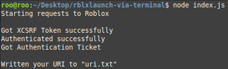

# roblox-cmd-launcher

Launch into a game of your choice with (basically) the same way as the website/app does it

~~it works somehow and also is very messy but who cares~~

~~this is literally just contacting api endpoints theres basically no need for this~~

# Features

- Joining a game
- Joining a private server (1.0.4+)
- Following users/friends to games (1.0.5+)
- Joining a specific server (1.0.8+)
- Joining from a generated private server link code (1.1.1+)

# Documentation

Documentation and a guide can be found [on the wiki.](https://github.com/Ev11nroo/roblox-cmd-launcher/wiki)
