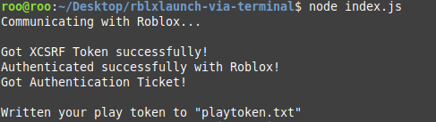

# Launch Roblox Player via a Terminal

Launch into a game of your choice with (basically) the same way as the website/app does it

[barebones](https://github.com/Ev11nroo/roblox-cmd-launcher/tree/barebone) branch is available

~~it works somehow and also is very messy but who cares~~

similar to [pizzaboxer/ROBLOX-desktop-launcher](https://github.com/pizzaboxer/ROBLOX-desktop-launcher)

# Features

- Joining a game
- Joining a private server (1.0.4+)
- Following users/friends to games (1.0.5+)

# Documentation

Documentation and a guide can be found [on the wiki.](https://github.com/Ev11nroo/roblox-cmd-launcher/wiki)
